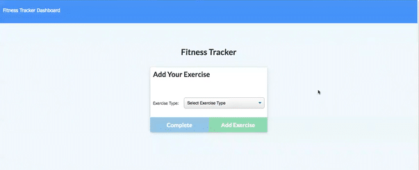

# Workout-tracker app

### Deployed Link (Heroku): 
https://daily-workouts.herokuapp.com/?id=6078ea7ce13645001519b67a

### GitHub Link: 
https://github.com/Herve8/workout-tracker

### License: 

## Demonstration

## User story
As a user, I want to be able to view create and track daily workouts. I want to be able to log multiple exercises in a workout on a given day. I should also be able to track the name, type, weight, sets, reps, and duration of exercise. If the exercise is a cardio exercise, I should be able to track my distance traveled.

## Business context
A consumer will reach their fitness goals more quickly when they track their workout progress.
## Acceptance criteria
When the user loads the page, they should be given the option to create a new workout or continue with their last workout.
The user should be able to:

Add exercises to the most recent workout plan.

Add new exercises to a new workout plan.

View the combined weight of multiple exercises from the past seven workouts on the stats page.

View the total duration of each workout from the past seven workouts on the stats page.

## Installation
The necessary dependencies were installed using the command:

npm install
## Technologies used
Language: Node.js, HTML, CSS

Dependencies: dotenv, Express, Mongoose, Morgan

Version Control: GitHub

Deployed with Heroku and MongoDB Atlas

